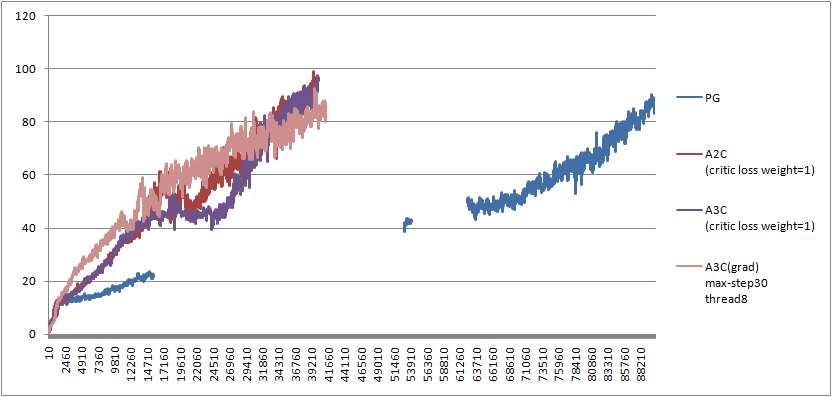

# Reinfocement Learning
* DQN
* Vanilla Policy Gradient
* Actor-Critic
* A3C
* DDPG

Breakout Train Graph: Episode-Reward

  

--------------------------------------
### Policy Gradient-REINFORCE(BreakoutDeterministic-v4)

Policy Gradient - REINFORCE - BreakoutDeterministic-v4  - reward(750)

  

- [Code](https://github.com/hccho2/RL-GYM/blob/master/08_5_softmax_pg_breakout.py)
- env = gym.make("BreakoutDeterministic-v4")
- env가 만들어 주는 state는 (210,160,3)형태의 uint8 data이다. Preprocessing을 통해, (80,80,1) 또는 (84,84,1) float data로 변환 
- Network입력 data:
	* 현재 state와 직전 state의 차이 값을 network의 입력값으로 사용: (80,80,1)
	* 현재 state와 직전 state의 차이 값들을 4개 쌓은 후, 입력값으로 사용: (80,80,4)
	* train해 보면, 후자가 더 잘 된다. 코드에서 train_state_stack(), infer2()
	* RMSprop보다 Adam을 사용하는 것이 좋다.
	* learning rate: 0.001은 잘 되지 않는다. 0.00025가 잘 된다.
	* image crop: Pong과 동일하게 불필요한 부분은 잘라내는게 좋다.
	* reward discount: dead가 발생하면 reward -1을 부여한다. reward discount할 때, Pong은 reward가 발생하는 시점을 기준으로 reward reset.  Breakout에서도 dead를 기준으로 실질적인 done처리를 해야한다. 
	* Neural Netowk 크기: convolution layer를 2단으로 하는 것보다 3단으로 하는 것이 좋다.
	* No-Operation: Breakout은 게임은 공이 코너쪽으로 가는 패튼으로 시작한다. 같은 패튼의 data가 많이 들어가는 것을 방지하기 위해, random하게 최대 30번의 action을 1(`FIRE')로 고정한다. dead상태일 때 reward를 -1로 한다면, No-Operation을 설정하지 않아도 효과가 있지만, overfitting을 방지하기 위해서는 해주는 것이 좋다. dead 상태에서 시작할 때는 최대 10번 No-Operation.
--------------------------------------
### Advantage Actor Critic(A2c)
A2C - Advantage Actor Critic - BreakoutDeterministic-v4 - reward(792)

  

--------------------------------------
### DQN

--------------------------------------
### DDPG
DDPG - Pendulum-v0 - 1000 step reward: -116.21

  

---------------------------------
Reference
- https://github.com/hunkim/ReinforcementZeroToAll
