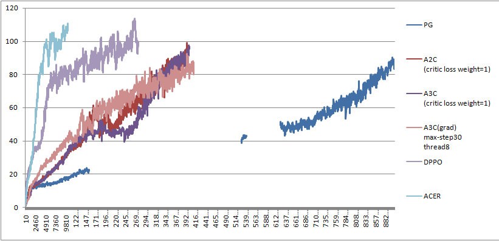

# Reinfocement Learning
* DQN
* Vanilla Policy Gradient
* Actor-Critic
* A3C
* DDPG

Breakout Train Graph: Episode-Reward

  

--------------------------------------
### Policy Gradient-REINFORCE(BreakoutDeterministic-v4)

Policy Gradient - REINFORCE - BreakoutDeterministic-v4  - reward(750)

  

- [Code](https://github.com/hccho2/RL-GYM/blob/master/08_5_softmax_pg_breakout.py)
- env = gym.make("BreakoutDeterministic-v4")
- env가 만들어 주는 state는 (210,160,3)형태의 uint8 data이다. Preprocessing을 통해, (80,80,1) 또는 (84,84,1) float data로 변환 
- Network입력 data:
	* 현재 state와 직전 state의 차이 값을 network의 입력값으로 사용: (80,80,1)
	* 현재 state와 직전 state의 차이 값들을 4개 쌓은 후, 입력값으로 사용: (80,80,4)
	* train해 보면, 후자가 더 잘 된다.
--------------------------------------
### Advantage Actor Critic(A2c)
A2C - Advantage Actor Critic - BreakoutDeterministic-v4 - reward(792)

  

--------------------------------------
### DQN

--------------------------------------
### DDPG
DDPG - Pendulum-v0 - 1000 step reward: -116.21

  

---------------------------------
Reference
- https://github.com/hunkim/ReinforcementZeroToAll
